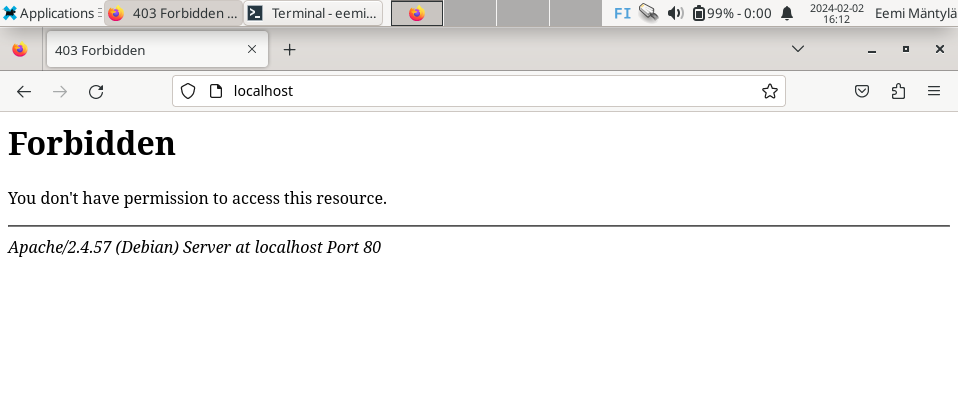
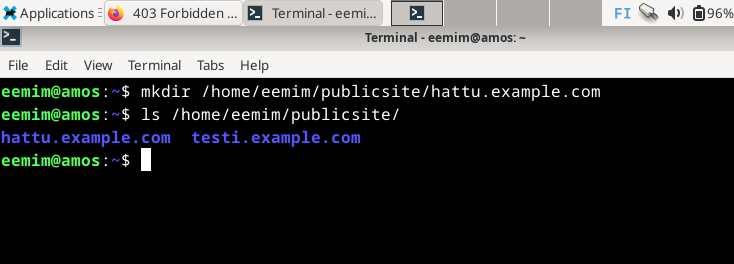
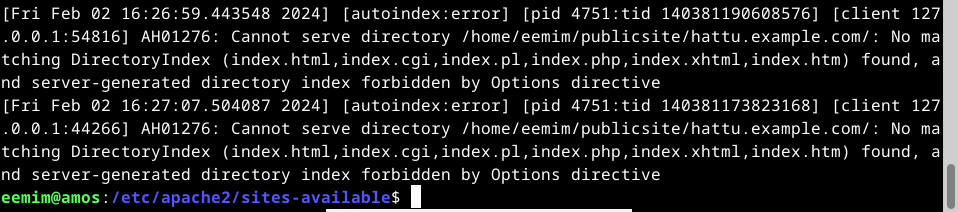
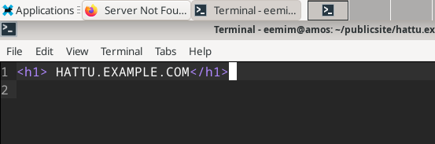
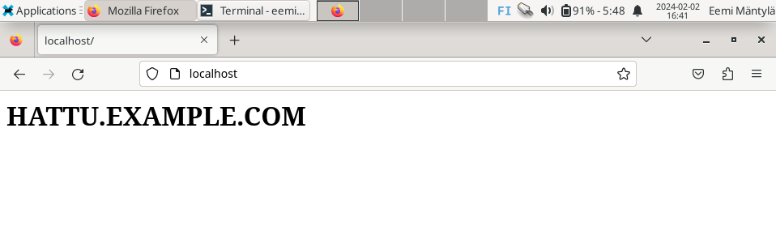
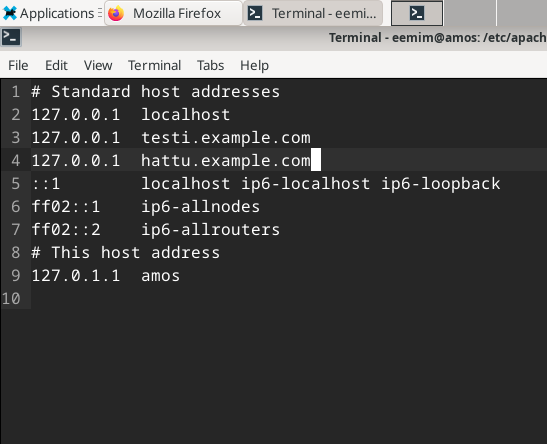
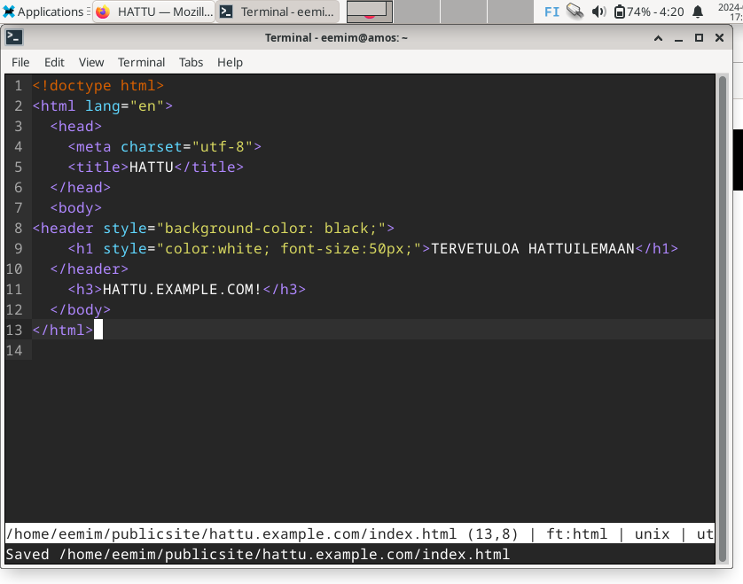
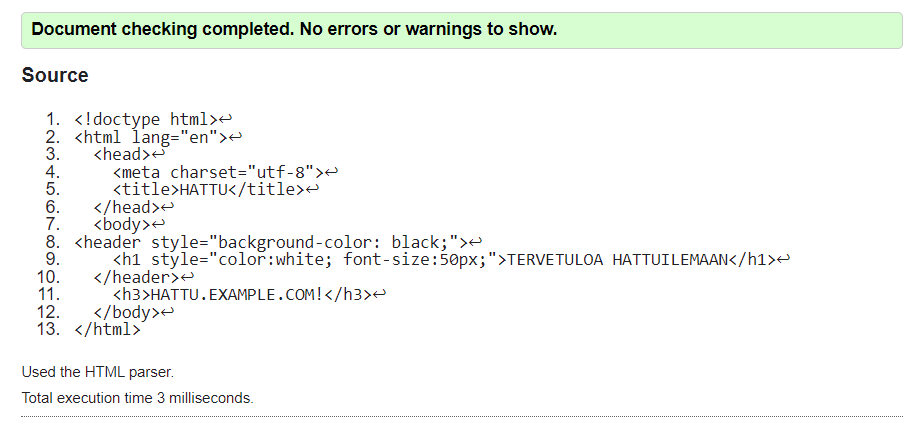

# h3

## x)
**Name-based Virtual Host Support**
-	“Name-based Virtual hosting” tarjoaa mahdollisuuden saman IP-osoitteen jakamiseen ja sitä tulisi käyttää, ellei käyttötarkoitus välttämättä vaadi IP-pohjaista ”isännöintiä”
-	Oikean palvelun löytämiseksi jaetusta IP-osoitteesta, Apache käyttää hyväksi ServerName ja ServerAlias määräyksiä (=directive)

**Name Based Virtual Hosts on Apache**
-	Asenna verkkopalvelin ja korvaa oletussivu

        $ sudo apt-get -y install apache2
        $ echo "Default"|sudo tee /var/www/html/index.html
-	Lisää uusi nimipohjainen virtuaalipalvelu (=name based virtual host)

        $ sudoedit /etc/apache2/sites-available/pyora.example.com.conf
        $ cat /etc/apache2/sites-available/pyora.example.com.conf
 	
``<VirtualHost *:80>``  
``    ServerName pyora.example.com `` 
``    ServerAlias www.pyora.example.com `` 
``   DocumentRoot /home/xubuntu/publicsites/pyora.example.com``  
``        <Directory /home/xubuntu/publicsites/pyora.example.com>``  
``            Require all granted``  
``        </Directory>``  
``</VirtualHost>``

    $ sudo a2ensite pyora.example.com
    $ sudo systemctl restart apache2
-	Tämän jälkeen voit luoda sivun normaalina käyttäjänä ilman sudoa

        $ mkdir -p /home/xubuntu/publicsites/pyora.example.com/
        $ echo pyora > /home/xubuntu/publicsites/pyora.example.com/index.html

## a-b)
-	Apache-weppipalvelin löytyi jo asennettuna, asennus hoituu kuitenkin komennolla

 	    $ sudo apt-get -y install apache2
 	
-	Weppipalvelin myös vastaa localhost-osoitteesta, logien loppuosa näkyy seuraavalla komennolla

        $ sudo tail /var/log/apache2/access.log

  

-	Numerosarja tulosteen edessä vastaa IP-osoitetta, jota sivusto käyttää
-	Tämän jälkeen tulee ``[ajankohta sekä aikavyöhyke]``
-	``GET`` vastaa ”pyyntötyyppiä”, jonka palvelin vastaanotti ja ``HTTP/1.1`` vastaa protokollaa
-	Näiden väliin jäävä ``/`` vastaa polkua, jota pyydettiin. Jos se on niin sanotusti tyhjä, on kyseessä luultavasti ”juuripolku” eli index.html tai vastaava
-	Seuraavana näkyvä luku ``200`` viittaa tässä tapauksessa pyynnön onnistuneeseen käsittelyyn ja sitä seuraava luku vastauksen kokoon tavuina
-	Lisäksi tarjolla on tietoa myös selaimesta sekä käyttöjärjestelmästä

## c)
**Etusivu uusiksi**  

- Luodaan ``hattu.example.com.conf``  

      $ sudoedit /etc/apache2/sites-available/hattu.example.com.conf

- Otetaan vanha sivu pois päältä ja laitetaan uusi ``hattu.example.com`` tilalle

- Tsekataan ``http://localhost`` selaimella

- Ja sen jälkeen ``error.log`` komennolla

      $ sudo tail /var/log/apache2/error.log

- Koitetaanpa ensin luoda samanlainen hakemistopolku, joka hatun ``.conf`` tiedostossa määritellään  
``publicsite``-kansio oli valmiiksi olemassa, joten voimme luoda ``hattu.example.com`` kansion suoraan sinne

      $ mkdir /home/<käyttäjä>/publicsite/hattu.example.com

- Käydään varmistamassa, että homma toteutui

      $ ls/home/<käyttäjä>/publicsite/

- Päivitetään selain ja katsotaan ``error.log`` uudestaan

- Vaikuttaisi huomauttavan ``directoryindexin`` puutteesta eli luodaan 
vaadittava ``index.html``, jossa lukee sivuston nimi ja kokeillaan uudestaan

      $ cd /home/<käyttäjä>/publicsite/hattu.example.com
      $ micro index.html

  

- Käydään vielä lisäämässä ``hattu.example.com`` hosteihin, jotta se löytyy myös selainhaulla ``hattu.example.com``

      $ sudoedit /etc/hosts

## e)
- Tehdään nopea html5 sivu ja validoidaan se [validaattorilla](https://validator.w3.org)

  

## f)
    $ curl hattu.example.com

Palauttaa urlista löytyvän sivuston sisällön terminaaliin

    $ curl -I hattu.example.com

Palauttaa vain HTTP-vastauksen otsakkeet, eikä itse sisältöä. Esimerkiksi sisällön tyyppi 
(=content-type) ilman itse sisältöä. Lisäksi tiedot palvelinohjelmasta, 
HTTP-haun ajankohdasta ja statuksesta sekä monesta muusta.

## m)
GitHub Education -paketti ladattu jo ennen kurssia

## n-o)
Tällä hetkellä toiminnassa kaksi eri sivustoa samasta IP-osoitteesta: 
``testi.example.com`` ja ``hattu.example.com``  

  
- Laitetaan vielä kolmas

      $ sudoedit /etc/apache2/sites-available/foo.example.com.conf

- ``enable`` ja käynnistys uudelleen

      $ sudo a2ensite foo.example.com
      $ sudo systemctl restart apache2

- Hakemistorunko ja index.html tällä kierroksella kerralla kuntoon

      $ mkdir /home/<käyttäjä>/publicsite/foo.example.com
      $ micro /home/<käyttäjä>/publicsite/foo.example.com/index.html

- Käydään vielä lisäämässä hosteihin

      $ sudoedit /etc/hosts

- Ja kaikki toimii

# Lähteet

HTTP.dev. 2023. HTTP/1.1. Luettavissa: https://http.dev/1.1. Luettu: 2.2.2024. 
  
Karvinen, T. 2018. Name Based Virtual Hosts on Apache – Multiple Websites to Single IP Address. Luettavissa: 
https://terokarvinen.com/2018/04/10/name-based-virtual-hosts-on-apache-multiple-websites-to-single-ip-address/. Luettu: 2.2.2024.  
  
Kuć, R. 2021. Understanding Apache Logging: How to View, Locate and Analyze Access & Error Logs. 
Luettavissa: https://sematext.com/blog/apache-logs/. Luettu: 2.2.2024.  
  
ReqBin. 2022. HTTP HEAD Request Method. Luettavissa: https://reqbin.com/Article/HttpHead. Luettu: 2.2.2024.  
  
The Apache Software Foundation. 2023. Name-based Virtual Host Support. 
Luettavissa: https://httpd.apache.org/docs/2.4/vhosts/name-based.html. Luettu: 2.2.2024.  

## Tehtävät
Karvinen, T. 2024. h3 Hello Web Server. Luettavissa: https://terokarvinen.com/2024/linux-palvelimet-2024-alkukevat/#h3-hello-web-server. Luettu: 2.2.2024.

